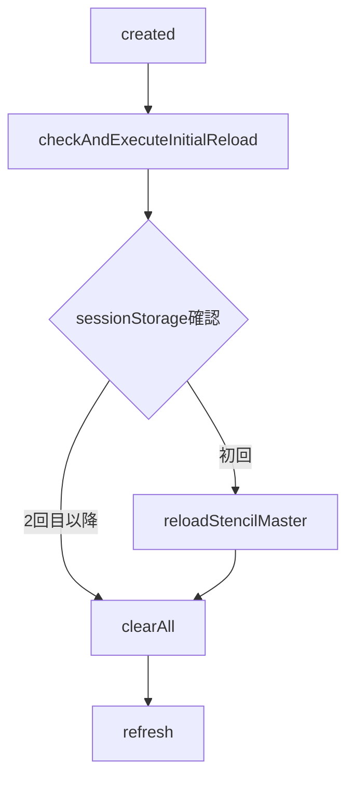
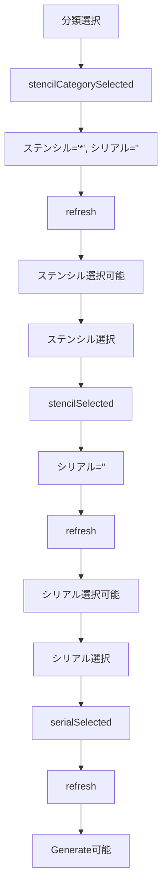

# ProMarker 払出画面 仕様書

## 1. 画面概要

ProMarker 払出画面は、テンプレート（ステンシル）を選択し、パラメータを入力してコード生成を行うための画面です。

## 2. 画面項目と状態遷移

### 2.1 ステンシル情報セクション

#### 2.1.1 分類（Category）ドロップダウン
- **ID**: `head_stencil_kind`
- **データバインド**: `fltStrStencilCategory`
- **初期状態**: 
  - `selected: '*'`（全選択）
  - `disabled: false`
- **状態遷移**:
  - 選択時: `cateogryNoSelected = false`
  - 未選択/`*`選択時: `cateogryNoSelected = true` ⚠️ **不整合**: `categoryNoSelected`のタイポあり
  - 処理中: `disabled = true`

#### 2.1.2 ステンシル（Stencil）ドロップダウン
- **ID**: `head_stencil_cd`
- **データバインド**: `fltStrStencilCd`
- **初期状態**:
  - `selected: '*'`
  - `disabled: true`（分類未選択時）
- **状態遷移**:
  - 有効化条件: `cateogryNoSelected === false`
  - 選択時: `stencilNoSelected = false`
  - 未選択/`*`選択時: `stencilNoSelected = true`

#### 2.1.3 シリアル（Serial）ドロップダウン
- **ID**: `head_serial_no`
- **データバインド**: `fltStrSerialNo`
- **初期状態**:
  - `selected: ''`（空文字）
  - `disabled: true`（ステンシル未選択時）
- **状態遷移**:
  - 有効化条件: `stencilNoSelected === false`
  - 選択時: `serialNoNoSelected = false`
  
⚠️ **不整合検出**: シリアル選択のロジックに以下の問題があります：
- `stencilSelected()`メソッドで無条件に`serialNoNoSelected = false`を設定（コメントアウトされた検証ロジックあり）
- `serialSelected()`メソッドでも無条件に`serialNoNoSelected = false`を設定
- 実際の選択状態を検証していない

### 2.2 データエレメントセクション

#### 2.2.1 動的パラメータフィールド
- **データバインド**: `eparams[]`
- **タイプ別表示**:
  - `valueType='file'`: ファイル選択ボタン + 無効化された入力フィールド
  - その他: 通常の入力フィールド
- **状態**: 
  - 処理中またはボタン無効時: `disabled = true`

### 2.3 アクションボタン

#### 2.3.1 ステンシル定義を再取得
- **有効化条件**: `!disabled && !processing && !stencilNoSelected`
- **動作**: 現在の選択状態を維持してパラメータを再取得

#### 2.3.2 全てクリア
- **有効化条件**: `!disabled && !processing`
- **動作**: 全選択状態をリセット

#### 2.3.3 Json形式
- **有効化条件**: `!disabled && !processing`
- **動作**: JSON編集モーダルを表示

#### 2.3.4 ステンシルマスタをリロード
- **有効化条件**: `!disabled && !processing`
- **動作**: バックエンドのステンシルマスタを再読み込み

#### 2.3.5 Generate
- **有効化条件**: `!disabled && !processing && !serialNoNoSelected`
- **動作**: コード生成を実行

## 3. イベントと状態遷移フロー

### 3.1 初期化フロー



### 3.2 選択フロー



## 4. APIエンドポイント仕様

### 4.1 `/mapi/apps/mste/api/suggest`

**目的**: ステンシル情報とパラメータ定義を取得

**リクエスト**:
```json
{
  "content": {
    "stencilCategoy": "string",      // "*"で全件
    "stencilCanonicalName": "string", // "*"で全件
    "serialNo": "string"              // "*"または空文字で全件
  }
}
```

⚠️ **不整合**: リクエストパラメータ名`stencilCategoy`はタイポ（正: `stencilCategory`）

**期待レスポンス**:
```json
{
  "data": {
    "data": {
      "model": {
        "stencil": {
          "config": {
            "id": "string",
            "name": "string",
            "description": "string",
            "lastUpdateUser": "string"
          }
        },
        "params": {
          "childs": [
            {
              "id": "string",
              "name": "string",
              "value": "string",
              "valueType": "string",
              "placeholder": "string",
              "note": "string"
            }
          ]
        },
        "fltStrStencilCategory": {
          "items": [{"value": "string", "text": "string"}],
          "selected": "string"
        },
        "fltStrStencilCd": {
          "items": [{"value": "string", "text": "string"}],
          "selected": "string"
        },
        "fltStrSerialNo": {
          "items": [{"value": "string", "text": "string"}],
          "selected": "string"
        }
      }
    }
  }
}
```

⚠️ **不整合**: ModelWrapper構造による`data.data.model`の三重ネスト

### 4.2 `/mapi/apps/mste/api/generate`

**目的**: コード生成実行

**リクエスト**:
```json
{
  "content": {
    "stencilCategoy": "string",
    "stencilCanonicalName": "string",
    "serialNo": "string",
    "[動的パラメータID]": "値"
  }
}
```

**期待レスポンス**:
```json
{
  "data": {
    "data": {
      "files": [
        ["fileId", "fileName"]
      ]
    }
  }
}
```

### 4.3 `/mapi/apps/mste/api/reloadStencilMaster`

**目的**: ステンシルマスタの再読み込み

**リクエスト**:
```json
{
  "content": {}
}
```

## 5. 状態管理の不整合と問題点

### 5.1 変数名の不整合
- `cateogryNoSelected` vs `categoryNoSelected`（177行目でタイポ）
- 一貫性のない命名により、状態管理に混乱が生じる可能性

### 5.2 シリアル選択ロジックの問題
```javascript
// 問題のあるコード（serialNoNoSelectedの状態管理）
stencilSelected() {
  // ...
  this.serialNoNoSelected = false;  // 無条件でfalseに設定
  // if (this.isFltStrSelected(this.fltStrSerialNo)) {  // コメントアウトされた検証
  //   this.serialNoNoSelected = false
  // }
}
```

**問題点**:
- ステンシル選択時に自動的にシリアルが選択可能になる
- 実際にシリアルが存在するかの検証なし
- Generateボタンがシリアル未選択でも有効になる可能性

### 5.3 初期化時の状態設定
```javascript
clearAll() {
  this.fltStrStencilCategory.selected = '*'
  this.fltStrStencilCd.selected = '*'
  this.fltStrSerialNo.selected = '*'  // シリアルも'*'に設定
  // ...
}
```

**問題点**:
- シリアルの初期値が`''`と`'*'`で不統一
- バックエンドの期待値との不整合の可能性

## 6. 推奨される修正

### 6.1 タイポの修正
```javascript
// ...existing code...
stencilCategorySelected () {
  // ...existing code...
  if (!this.isFltStrSelected(this.fltStrStencilCategory) ||
    this.fltStrStencilCategory.selected === '*') {
    this.cateogryNoSelected = true  // ← categoryNoSelectedに修正
    return false
  }
  // ...existing code...
}
// ...existing code...
```

### 6.2 シリアル選択ロジックの改善
```javascript
// ...existing code...
stencilSelected () {
  this.fltStrSerialNo.selected = ''
  this.cateogryNoSelected = false
  this.stencilNoSelected = false
  this.serialNoNoSelected = true  // デフォルトはtrue

  if (!this.isFltStrSelected(this.fltStrStencilCd) ||
    this.fltStrStencilCd.selected === '*') {
    this.stencilNoSelected = true
    return false
  }

  this.refresh()

  // refreshの結果を待ってから判定
  this.$nextTick(() => {
    if (this.isFltStrSelected(this.fltStrSerialNo)) {
      this.serialNoNoSelected = false
    }
  })

  return true
}
// ...existing code...
```

### 6.3 APIパラメータ名の統一
```javascript
// ...existing code...
createRequest (body) {
  const pitems = {
    stencilCategory: body.fltStrStencilCategory.selected,  // Categoy → Category
    stencilCanonicalName: body.fltStrStencilCd.selected,
    serialNo: body.fltStrSerialNo.selected
  }
  // ...existing code...
}
// ...existing code...
```

## 7. その他の仕様

### 7.1 セッション管理
- 初回訪問時のみ`reloadStencilMaster`を自動実行
- `sessionStorage`を使用して実行状態を管理

### 7.2 エラーハンドリング
- API エラー時はモーダルダイアログで表示
- 配列形式と文字列形式の両方のエラーメッセージに対応

### 7.3 ファイルアップロード
- ファイルタイプのパラメータは専用のアップロードダイアログを使用
- 複数ファイルの選択が可能（カンマ区切りでfileIdを保存）

### 7.4 JSON形式での条件編集
- 現在の選択状態をJSON形式でエクスポート/インポート可能
- バリデーション機能付き

---