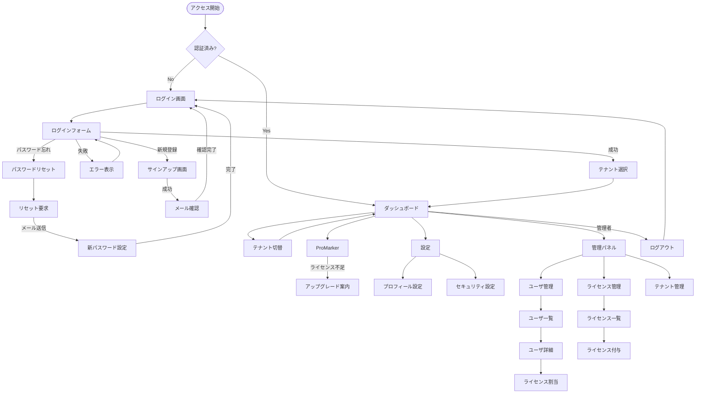

# ProMarker SaaS化対応 実装計画書

**作成日**: 2025年11月20日  
**対象プロダクト**: mirelplatform / ProMarker  
**目的**: マルチテナント・ライセンス管理を備えたエンタープライズSaaS基盤の構築

---

## 📋 目次

1. [現状分析と課題](#1-現状分析と課題)
2. [要件定義](#2-要件定義)
3. [アーキテクチャ設計](#3-アーキテクチャ設計)
4. [データモデル設計](#4-データモデル設計)
5. [バックエンド実装仕様](#5-バックエンド実装仕様)
6. [フロントエンド実装仕様](#6-フロントエンド実装仕様)
7. [API仕様](#7-api仕様)
8. [セキュリティ・コンプライアンス](#8-セキュリティコンプライアンス)
9. [パフォーマンス・スケーラビリティ](#9-パフォーマンススケーラビリティ)
10. [運用・可観測性](#10-運用可観測性)
11. [国際化・多言語対応](#11-国際化多言語対応)
12. [実装フェーズ](#12-実装フェーズ)
13. [テスト戦略](#13-テスト戦略)
14. [画面遷移図](#14-画面遷移図)
15. [設定管理](#15-設定管理)

---

## 1. 現状分析と課題

### 1.1 既存実装の確認

#### 🔧 部分実装（未検証）
- **認証基盤の骨格**: Strategy Pattern実装、ただし実運用未検証
  - `SessionAuthenticationService`: 実装あり、セッション管理フロー未検証
  - `JwtAuthenticationService`: 実装あり、トークン発行・検証未検証
  - `WebSecurityConfig`: Spring Security設定あり、認可制御未整備
- **データモデルの骨格**: エンティティ定義のみ存在
  - `Tenant`, `User`, `TenantSystemMaster` エンティティあり
  - リレーション未整備、制約未定義、マイグレーション未作成

#### ⚠️ 完全未実装
- **コンテキスト管理**: リクエストスコープの統一コンテキストが未実装
  - カレントユーザ・テナント情報の自動解決機構なし
  - ライセンス判定の統一インターフェースなし
- **マルチテナント**: エンティティはあるが実運用機構が未整備
  - テナント切替機能なし
  - テナント間データ分離機構なし
- **ライセンス管理**: 完全未実装
  - ライセンスモデルなし
  - 機能制限ロジックなし
- **監査ログ**: 未実装
- **RBAC**: 基本的な認証のみ、詳細な権限制御なし

---

## 2. 要件定義

### 2.1 機能要件

#### ユーザ管理
- **1ユーザ = 1ユーザID**: 各種属性情報を保持
- **複数テナント所属**: 1ユーザが複数テナントに参加可能
- **認証方式拡張**: Strategy Patternで複数認証方式対応
  - 初期: パスワード認証（bcryptハッシュ）
  - 将来: GitHub OAuth, OTP等

#### テナント管理
- **マルチテナント**: 1ユーザが複数のテナント（ワークスペース）に所属
- **カレントテナント切替**: ログイン中にテナントを動的に切替可能
- **テナント内ロール**: OWNER, MANAGER, MEMBER, GUEST

#### ライセンス管理
- **3段階ライセンス**: FREE, PRO, MAX
- **スコープ**: USER単位またはTENANT単位でライセンス付与
- **アプリケーションライセンス**: ProMarker等のアプリごとに有効化
- **初回ライセンス**: システム設定でデフォルトライセンスを指定
- **ライセンス判定**: バックエンドで当該ユーザ/テナントのライセンス区分を判断

### 2.2 非機能要件

#### セキュリティ
- パスワード: bcrypt (cost factor 12以上)
- トークン管理: Access Token 15分、Refresh Token 30日
- レート制限: ログイン試行 5回/分
- CSRF対策、XSS対策、SQL Injection対策

#### パフォーマンス
- ライセンス判定: リクエスト内キャッシュ + アプリケーションキャッシュ
- API応答時間: P95 < 500ms
- 同時接続: 1000ユーザ対応

#### 可用性
- ヘルスチェック: `/actuator/health`
- ログ: 構造化ログ + Trace ID
- メトリクス: Prometheus形式

#### コンプライアンス
- 監査ログ: すべての重要操作を記録
- データ暗号化: 個人情報のAES-256暗号化
- GDPR対応: データ削除・匿名化機能

---

## 3. アーキテクチャ設計

### 3.1 システムアーキテクチャ

```
┌─────────────────────────────────────────────┐
│         Frontend (React 19 + Vite)          │
│  - Zustand (状態管理)                        │
│  - TanStack Query (API通信)                  │
│  - @mirel/ui (デザインシステム)               │
└─────────────────┬───────────────────────────┘
                  │ HTTPS (/mapi/*)
┌─────────────────▼───────────────────────────┐
│       Backend (Spring Boot 3.3)             │
│  ┌───────────────────────────────────────┐  │
│  │  Security Layer                       │  │
│  │  - Spring Security                    │  │
│  │  - JWT/Session Authentication         │  │
│  │  - ExecutionContextFilter             │  │
│  └───────────────────────────────────────┘  │
│  ┌───────────────────────────────────────┐  │
│  │  Service Layer                        │  │
│  │  - @RequireLicense AOP                │  │
│  │  - @Audited AOP                       │  │
│  │  - Cache (@Cacheable)                 │  │
│  └───────────────────────────────────────┘  │
│  ┌───────────────────────────────────────┐  │
│  │  Repository Layer                     │  │
│  │  - JPA Repositories                   │  │
│  │  - Hibernate Filter (Tenant分離)      │  │
│  └───────────────────────────────────────┘  │
└─────────────────┬───────────────────────────┘
                  │
┌─────────────────▼───────────────────────────┐
│       Database (H2 / PostgreSQL)            │
│  - User, Tenant, UserTenant                 │
│  - ApplicationLicense                       │
│  - RefreshToken, AuditLog                   │
└─────────────────────────────────────────────┘
```

### 3.2 コンテキスト管理設計（重要）

**課題**: バックエンドでカレントユーザ・テナント・ライセンス情報を統一的に管理

**解決策**: Spring `@Scope(SCOPE_REQUEST)` による ExecutionContext

```
リクエスト開始
    ↓
ExecutionContextFilter (OncePerRequestFilter)
    ├─ Spring Security → Authentication取得
    ├─ User情報をDBから取得
    ├─ テナントID解決（Header > JWT > User Default > System Default）
    ├─ Tenant情報をDBから取得
    ├─ ApplicationLicense一覧を取得（USER/TENANTスコープ両方）
    └─ ExecutionContext に設定
    ↓
Controller / Service Layer
    ├─ ExecutionContext を @Autowired で参照
    ├─ executionContext.getCurrentUser()
    ├─ executionContext.getCurrentTenant()
    └─ executionContext.hasLicense(app, tier)
    ↓
リクエスト終了（スコープ自動破棄）
```

**利点**:
- リクエストごとに自動初期化・破棄
- ThreadLocal管理不要
- テストが容易
- Spring標準機能のみで実現

---

## 4. データモデル設計

---

## 4. データモデル設計

### 4.1 ER図概要

```
User ──────< UserTenant >────── Tenant
  │                               │
  │                               │
  └──< ApplicationLicense >───────┘
       (subjectType: USER)   (subjectType: TENANT)
  
User ────< RefreshToken

User/Tenant ────< AuditLog
```

### 4.1 ユーザ（User）
```yaml
User:
  id: UUID (PK)
  userId: string (UNIQUE, ログインID)
  email: string (UNIQUE)
  displayName: string
  firstName: string
  lastName: string
  passwordHash: string (bcrypt)
  salt: string (optional, for legacy)
  attributes: JSON (拡張属性)
  roles: string[] (システムロール)
  isActive: boolean
  emailVerified: boolean
  lastLoginAt: timestamp
  createdAt: timestamp
  updatedAt: timestamp
```

### 4.2 テナント（Tenant）
```yaml
Tenant:
  id: UUID (PK)
  tenantId: string (UNIQUE, URL-safe)
  name: string
  displayName: string
  description: string
  orgId: string (組織ID)
  settings: JSON (テナント設定)
  isActive: boolean
  createdAt: timestamp
  updatedAt: timestamp
```

### 4.3 ユーザ・テナント関連（UserTenant）
```yaml
UserTenant:
  id: UUID (PK)
  userId: UUID (FK)
  tenantId: UUID (FK)
  roleInTenant: string (テナント内ロール)
  isDefault: boolean (デフォルトテナント)
  joinedAt: timestamp
  leftAt: timestamp (nullable)
  INDEX: (userId, tenantId) UNIQUE
```

### 4.4 アプリケーションライセンス（ApplicationLicense）
```yaml
ApplicationLicense:
  id: UUID (PK)
  subjectType: enum (USER, TENANT)
  subjectId: UUID (user_id or tenant_id)
  applicationId: string (promarker, etc.)
  tier: enum (FREE, PRO, MAX)
  features: JSON (有効機能リスト)
  grantedAt: timestamp
  expiresAt: timestamp (nullable)
  grantedBy: UUID (付与者)
  INDEX: (subjectType, subjectId, applicationId)
```

### 4.5 認証トークン（RefreshToken）
```yaml
RefreshToken:
  id: UUID (PK)
  userId: UUID (FK)
  tokenHash: string (UNIQUE)
  deviceInfo: string
  expiresAt: timestamp
  createdAt: timestamp
  revokedAt: timestamp (nullable)
  INDEX: tokenHash
```

### 4.6 監査ログ（AuditLog）
```yaml
AuditLog:
  id: UUID (PK)
  userId: UUID (FK)
  tenantId: UUID (FK, nullable)
  eventType: string (LOGIN, LOGOUT, LICENSE_CHANGE, etc.)
  resourceType: string
  resourceId: string
  metadata: JSON
  ipAddress: string
  userAgent: string
  createdAt: timestamp
  INDEX: (userId, createdAt)
```

---

## 5. バックエンド実装仕様

### 5.1 リクエストコンテキスト管理（ExecutionContext）

#### 5.1.1 ExecutionContext（リクエストスコープ統一コンテキスト）
```java
// backend/src/main/java/jp/vemi/mirel/foundation/context/ExecutionContext.java
@Component
@Scope(value = WebApplicationContext.SCOPE_REQUEST, proxyMode = ScopedProxyMode.TARGET_CLASS)
public class ExecutionContext {
    private User currentUser;
    private Tenant currentTenant;
    private List<ApplicationLicense> effectiveLicenses;
    private Map<String, Object> attributes;
    
    // リクエストメタデータ
    private String requestId;
    private String ipAddress;
    private String userAgent;
    private Instant requestTime;
    
    // ライセンスキャッシュ（リクエスト内）
    private Map<String, Boolean> licenseCache = new ConcurrentHashMap<>();
    
    public boolean hasLicense(String applicationId, LicenseTier tier) {
        String cacheKey = applicationId + ":" + tier;
        return licenseCache.computeIfAbsent(cacheKey, k -> {
            return effectiveLicenses.stream()
                .anyMatch(l -> l.getApplicationId().equals(applicationId) 
                    && l.getTier().ordinal() >= tier.ordinal());
        });
    }
}
```

#### 5.1.2 ExecutionContextFilter（コンテキスト解決Filter）
```java
// backend/src/main/java/jp/vemi/mirel/foundation/context/ExecutionContextResolver.java
@Component
@Order(Ordered.HIGHEST_PRECEDENCE + 10)
public class ExecutionContextFilter extends OncePerRequestFilter {
    
    @Autowired
    private ExecutionContext executionContext;
    
    @Autowired
    private UserRepository userRepository;
    
    @Autowired
    private TenantRepository tenantRepository;
    
    @Autowired
    private ApplicationLicenseRepository licenseRepository;
    
    @Override
    protected void doFilterInternal(HttpServletRequest request, 
                                   HttpServletResponse response, 
                                   FilterChain filterChain) {
        try {
            // 1. Spring SecurityからユーザIDを取得
            Authentication auth = SecurityContextHolder.getContext().getAuthentication();
            if (auth != null && auth.isAuthenticated()) {
                String userId = auth.getName();
                User user = userRepository.findById(userId).orElse(null);
                executionContext.setCurrentUser(user);
                
                // 2. カレントテナント解決
                //    優先順位: Header > JWT Claim > User Default > System Default
                String tenantId = resolveTenantId(request, auth, user);
                Tenant tenant = tenantRepository.findById(tenantId).orElse(null);
                executionContext.setCurrentTenant(tenant);
                
                // 3. 有効ライセンス取得（USER/TENANTスコープ両方）
                List<ApplicationLicense> licenses = licenseRepository
                    .findEffectiveLicenses(userId, tenantId);
                executionContext.setEffectiveLicenses(licenses);
            }
            
            // 4. リクエストメタデータ設定
            executionContext.setRequestId(UUID.randomUUID().toString());
            executionContext.setIpAddress(request.getRemoteAddr());
            executionContext.setUserAgent(request.getHeader("User-Agent"));
            executionContext.setRequestTime(Instant.now());
            
            filterChain.doFilter(request, response);
        } finally {
            // リクエスト終了後のクリーンアップはScopeが自動処理
        }
    }
    
    private String resolveTenantId(HttpServletRequest request, 
                                   Authentication auth, User user) {
        // 1. X-Tenant-ID ヘッダー
        String headerTenantId = request.getHeader("X-Tenant-ID");
        if (StringUtils.hasText(headerTenantId)) {
            return headerTenantId;
        }
        
        // 2. JWT ClaimからtenantId
        if (auth instanceof JwtAuthenticationToken) {
            Jwt jwt = ((JwtAuthenticationToken) auth).getToken();
            String jwtTenantId = jwt.getClaimAsString("tenant_id");
            if (StringUtils.hasText(jwtTenantId)) {
                return jwtTenantId;
            }
        }
        
        // 3. Userのデフォルトテナント
        if (user != null && StringUtils.hasText(user.getTenantId())) {
            return user.getTenantId();
        }
        
        // 4. システムデフォルト
        return "default";
    }
}
```

### 5.2 認証アーキテクチャ（既存拡張）
```java
// 既存のAuthenticationServiceを拡張
// backend/src/main/java/jp/vemi/mirel/security/AuthenticationService.java
public interface AuthenticationService {
    String authenticate(String username, String password);
    JwtDecoder getJwtDecoder();
    boolean isJwtSupported();
    
    // 新規追加: テナント指定ログイン
    AuthenticationResult authenticateWithTenant(String username, String password, String tenantId);
}

// backend/src/main/java/jp/vemi/mirel/security/dto/AuthenticationResult.java
@Data
@Builder
public class AuthenticationResult {
    private String accessToken;
    private String refreshToken;
    private User user;
    private Tenant currentTenant;
    private List<ApplicationLicense> licenses;
}
```

### 5.3 ライセンス判定アノテーション（AOP）
```java
// backend/src/main/java/jp/vemi/mirel/foundation/security/RequireLicense.java
@Target({ElementType.METHOD, ElementType.TYPE})
@Retention(RetentionPolicy.RUNTIME)
public @interface RequireLicense {
    String application();
    LicenseTier tier() default LicenseTier.FREE;
}

// backend/src/main/java/jp/vemi/mirel/foundation/security/LicenseCheckAspect.java
@Aspect
@Component
public class LicenseCheckAspect {
    @Autowired
    private ExecutionContext executionContext;
    
    @Before("@annotation(requireLicense)")
    public void checkLicense(RequireLicense requireLicense) {
        if (!executionContext.hasLicense(requireLicense.application(), 
                                         requireLicense.tier())) {
            throw new LicenseRequiredException(requireLicense.application(), 
                                              requireLicense.tier());
        }
    }
}
```

---

## 7. API仕様

### 7.1 認証API
```yaml
# ログイン
POST /mapi/auth/login
Request:
  userId: string (or email)
  password: string
  tenantId?: string (optional, 初回テナント指定)
Response:
  user: UserDto
  tokens: { accessToken, refreshToken }
  currentTenant: TenantContext

# ログアウト  
POST /mapi/auth/logout
Headers: Authorization: Bearer {token}

# トークン更新
POST /mapi/auth/refresh
Request:
  refreshToken: string
Response:
  tokens: { accessToken, refreshToken }

# パスワードリセット要求
POST /mapi/auth/password-reset-request
Request:
  email: string

# パスワードリセット実行
POST /mapi/auth/password-reset
Request:
  token: string
  newPassword: string
```

### 7.2 ユーザAPI
```yaml
# 現在のユーザ情報
GET /mapi/users/me
Response:
  user: UserDto
  currentTenant: TenantContext
  licenses: ApplicationLicense[]

# プロフィール更新
PUT /mapi/users/me
Request:
  displayName?: string
  firstName?: string
  lastName?: string
  attributes?: object
```

### 7.3 テナントAPI  
```yaml
# 所属テナント一覧
GET /mapi/tenants
Response:
  tenants: TenantDto[]

# カレントテナント切替
POST /mapi/tenants/{tenantId}/switch
Response:
  tenant: TenantContext
  effectiveLicenses: ApplicationLicense[]

# テナント作成（権限必要）
POST /mapi/tenants
Request:
  tenantId: string
  name: string
  displayName: string
```

### 7.4 ライセンスAPI
```yaml
# 利用可能アプリケーション一覧
GET /mapi/licenses/apps
Response:
  applications: ApplicationInfo[]

# ライセンス割当（管理者）
POST /mapi/admin/licenses/assign
Request:
  subjectType: USER | TENANT
  subjectId: UUID
  applicationId: string
  tier: FREE | PRO | MAX

# ライセンス取消（管理者）
DELETE /mapi/admin/licenses/{id}
```

---

## 6. フロントエンド実装仕様

### 6.1 状態管理（Zustand）
```typescript
// apps/frontend-v3/src/stores/authStore.ts
interface AuthState {
  user: User | null;
  isAuthenticated: boolean;
  currentTenant: Tenant | null;
  availableTenants: Tenant[];
  licenses: ApplicationLicense[];
  
  // Actions
  login: (credentials: LoginCredentials) => Promise<void>;
  logout: () => Promise<void>;
  switchTenant: (tenantId: string) => Promise<void>;
  refreshToken: () => Promise<void>;
}
```

### 6.2 新規ページ一覧
- `/login` - ログイン画面
- `/signup` - ユーザ登録
- `/password-reset` - パスワードリセット
- `/settings/profile` - プロフィール設定
- `/settings/security` - セキュリティ設定
- `/admin/users` - ユーザ管理（管理者）
- `/admin/licenses` - ライセンス管理（管理者）
- `/admin/tenants` - テナント管理（管理者）

### 6.3 @mirel/ui 拡張コンポーネント（既存資産活用）
```typescript
// packages/ui/src/components/auth/
- AuthLayout (ログイン/サインアップ共通レイアウト)
- LoginForm (既存Input/Button/Card活用)
- SignupForm

// packages/ui/src/components/tenant/
- TenantSwitcher (既存Select/DropdownMenu活用)
- TenantBadge (既存Badge拡張)

// packages/ui/src/components/license/
- LicenseBadge (既存Badge拡張、tier別色分け)
- LicenseUpgradePrompt (既存Alert/Dialog活用)

// packages/ui/src/components/user/
- UserAvatar (新規、アバター表示)
- UserMenu (既存DropdownMenu活用)

// packages/ui/src/components/admin/
- DataTable (既存Table拡張、ページング・ソート対応)
- FilterBar (既存Input/Select組み合わせ)
- ActionBar (既存Button/DropdownMenu組み合わせ)
```

### 6.4 認証保護機構
```typescript
// apps/frontend-v3/src/lib/auth/
- ProtectedRoute (React Router v6対応)
- useAuth (認証状態Hook)
- useLicense (ライセンス判定Hook)
- withAuth (HOC、レガシー対応)
```

---

## 12. 実装フェーズ

### Phase 1: 基盤構築（2週間）
1. DBスキーマ作成・マイグレーション
2. 認証ストラテジ基盤実装
3. JWT/RefreshToken処理
4. 基本的なユーザCRUD

### Phase 2: 認証機能（1週間）
1. ログイン/ログアウトAPI
2. フロントエンド認証フロー
3. Protected Route実装
4. セッション管理

### Phase 3: テナント機能（1週間）
1. テナントCRUD
2. テナント切替機能
3. テナントコンテキスト管理
4. マルチテナント対応

### Phase 4: ライセンス機能（1週間）
1. ライセンスモデル実装
2. ライセンス判定ロジック
3. 初回ユーザライセンス付与
4. 管理画面実装

### Phase 5: テスト・監査（1週間）
1. E2Eテスト作成
2. 監査ログ実装
3. セキュリティテスト
4. 負荷テスト

---

## 14. 画面遷移図



---

## 8. セキュリティ・コンプライアンス

### 8.1 基本セキュリティ要件

#### パスワード
- bcrypt (cost factor: 12以上)
- 最小8文字、複雑性要件
- パスワード履歴管理（オプション）

#### トークン管理
- Access Token: 15分有効
- Refresh Token: 30日有効
- HttpOnly, Secure, SameSite=Strict Cookie
- CSRF対策

#### レート制限
- ログイン試行: 5回/分
- API呼び出し: 100回/分（通常）
- パスワードリセット: 3回/時

---

## 15. 設定管理

### application.yml
```yaml
mirel:
  auth:
    jwt:
      secret: ${JWT_SECRET}
      access-expiry: 15m
      refresh-expiry: 30d
    password:
      bcrypt-strength: 12
      min-length: 8
    rate-limit:
      login-attempts: 5
      window: 60s
  license:
    default-tier: FREE
    default-apps:
      - promarker
    initial-admin-tier: MAX
  tenant:
    default-name: "Default Workspace"
    max-per-user: 10
```

---

## 13. テスト戦略

### 13.1 ユニットテスト
- 認証ストラテジ
- ライセンス判定ロジック
- JWT処理
- ExecutionContext解決ロジック
- テナント切替ロジック

### 13.2 統合テスト  
- 認証フロー全体
- テナント切替
- ライセンス適用
- マルチテナントデータ分離

### 13.3 E2Eテスト（Playwright）
```typescript
// packages/e2e/tests/specs/auth/login.spec.ts
test.describe('Authentication Flow', () => {
  test('should login with valid credentials', async ({ page }) => {
    // ログインフロー検証
  });
  
  test('should switch tenant', async ({ page }) => {
    // テナント切替検証
  });
  
  test('should enforce license restrictions', async ({ page }) => {
    // ライセンス制限検証
  });
});
```

---

## 8.2 データ分離・セキュリティ基盤

#### 8.2.1 マルッチテナントデータ分離（Row-Level Security）
**課題**: 各テナントのデータが混在しないようクエリレベルで強制分離が必要

**実装方針**:
- **Hibernate Filter**: `@FilterDef` + `@Filter` でテナントID自動フィルタリング
- **EntityListener**: エンティティ保存時に自動で `tenantId` を設定
- **QueryInterceptor**: ネイティブクエリでのテナントID強制付与

```java
// @TenantScoped アノテーション
// エンティティに付与することでテナント分離を強制
@Target(ElementType.TYPE)
@Retention(RetentionPolicy.RUNTIME)
public @interface TenantScoped {}

// Hibernate FilterをExecutionContextから自動設定
```

#### 8.2.2 監査ログ（Audit Trail）
**課題**: GDPR/個人情報保護法対応、セキュリティインシデント追跡

**実装方針**:
- **AOP**: `@Audited` アノテーションで自動記録
- **Spring Data Envers**: エンティティ変更履歴を自動保存
- **カスタムAuditLog**: ログイン/ログアウト/権限変更/データアクセスを記録
- **非同期ログ**: `@Async` + キューイングで本体処理に影響させない

**記録対象**:
- 認証イベント（ログイン成功/失敗、パスワードリセット）
- 権限変更（ロール付与/剥奪、ライセンス変更）
- データアクセス（重要データの参照・更新・削除）
- テナント切替

### 8.3 RBAC（Role-Based Access Control）拡張
**課題**: システムロール、テナント内ロール、リソースレベル権限の3階層制御

**実装方針**:
- **システムロール**: `SYSTEM_ADMIN`, `TENANT_ADMIN`, `USER`
- **テナント内ロール**: `OWNER`, `MANAGER`, `MEMBER`, `GUEST`
- **リソース権限**: `READ`, `WRITE`, `DELETE`, `ADMIN`

```java
// @RequireRole アノテーション（AOPでチェック）
@RequireRole(system = "TENANT_ADMIN", tenant = "OWNER")
public void deleteTenant(String tenantId) {}

// @RequirePermission（リソースレベル）
@RequirePermission(resource = "promarker:stencil", action = "DELETE")
public void deleteStencil(String stencilId) {}
```

---

## 9. パフォーマンス・スケーラビリティ

### 9.1 キャッシュ戦略（Spring Cache）
**課題**: ライセンス判定、ユーザ情報、テナント設定の頻繁アクセス

**実装方針**:
- **L1 Cache**: ExecutionContext内（リクエストスコープ）
- **L2 Cache**: Redis/Caffeine（アプリケーションスコープ）
- **Cache-Aside Pattern**: データ変更時のキャッシュ無効化

**キャッシュ対象**:
- ユーザ基本情報（5分TTL）
- ライセンス情報（1分TTL、変更時即時無効化）
- テナント設定（10分TTL）
- ロール・権限マッピング（30分TTL）

```java
@Cacheable(value = "user-licenses", key = "#userId + ':' + #tenantId")
public List<ApplicationLicense> getUserLicenses(String userId, String tenantId) {}

@CacheEvict(value = "user-licenses", key = "#userId + ':*'")
public void updateLicense(String userId, ...) {}
```

### 9.2 レート制限（Rate Limiting）
**課題**: API悪用防止、DoS対策、Tier別制限

**実装方針**:
- **Bucket4j**: Token Bucket アルゴリズム
- **Spring AOP**: `@RateLimit` アノテーション
- **Tier別制限**: FREE=10req/min, PRO=100req/min, MAX=1000req/min

```java
@RateLimit(tier = LicenseTier.FREE, limit = 10, window = "1m")
public ApiResponse<?> generateStencil(...) {}
```

### 9.3 非同期処理（Async Task Management）
**課題**: 大量データエクスポート、バッチ処理、メール送信

**実装方針**:
- **Spring @Async**: 軽量非同期処理
- **Spring Batch**: 大規模バッチ処理
- **TaskExecutor Pool**: Tier別スレッドプール分離

**非同期対象**:
- メール送信（パスワードリセット、招待メール）
- レポート生成・エクスポート
- 監査ログ書き込み
- Webhook通知

---

## 10. 運用・可観測性

### 10.1 ヘルスチェック・メトリクス
**課題**: サービス正常性監視、パフォーマンス分析

**実装方針**:
- **Spring Actuator**: `/actuator/health`, `/actuator/metrics`
- **Micrometer**: Prometheus形式でメトリクス公開
- **カスタムHealthIndicator**: DB接続、Redis接続、外部API疎通確認

**メトリクス**:
- リクエスト数（エンドポイント別、テナント別、ユーザ別）
- レスポンスタイム（P50, P95, P99）
- エラー率（4xx, 5xx）
- アクティブユーザ数、アクティブテナント数
- ライセンス利用状況

### 10.2 分散トレーシング（OpenTelemetry）
**課題**: マイクロサービス化を見据えたリクエスト追跡

**実装方針**:
- **Trace ID**: リクエストごとに一意なIDを生成（ExecutionContext.requestId）
- **ログ連携**: すべてのログにTrace ID埋め込み
- **将来対応**: Jaeger/Zipkin連携準備

### 10.3 エラーハンドリング・通知
**課題**: 障害早期検知、ユーザへの適切なフィードバック

**実装方針**:
- **@ControllerAdvice**: グローバル例外ハンドラ
- **ErrorCode体系**: エラー種別を一元管理（AUTH-001, LICENSE-001等）
- **ユーザ向けメッセージ**: 技術詳細を隠蔽、操作ガイダンス提供
- **管理者通知**: 重大エラー時のSlack/Email通知

---

## 11. 国際化・多言語対応

### 11.1 i18n基盤
**課題**: グローバル展開を見据えた多言語対応

**実装方針**:
- **バックエンド**: Spring MessageSource
- **フロントエンド**: react-i18next
- **デフォルト言語**: 日本語（ja-JP）
- **対応言語**: 英語（en-US）を第一優先で追加

**多言語化対象**:
- エラーメッセージ
- バリデーションメッセージ
- メール本文
- UI文言（ボタン、ラベル、ヘルプテキスト）

### 11.2 タイムゾーン管理
**課題**: グローバルユーザの時刻表示

**実装方針**:
- **DB保存**: すべてUTC
- **API応答**: ISO 8601形式（`2025-11-20T12:00:00Z`）
- **フロントエンド**: ブラウザタイムゾーンで自動変換
- **ユーザ設定**: タイムゾーン選択可能

### 8.4 データ保護・プライバシー

#### 8.4.1 個人情報暗号化
**課題**: GDPR、個人情報保護法対応

**実装方針**:
- **保存時暗号化**: email等の個人情報をAES-256で暗号化
- **JPA Converter**: 透過的な暗号化・復号化
- **Key Management**: 環境変数または外部KMS（将来）

#### 8.4.2 データ削除・匿名化
**課題**: 「忘れられる権利」対応

**実装方針**:
- **論理削除**: `deleteFlag` + 保持期間（90日）
- **物理削除バッチ**: 保持期間経過後に自動削除
- **匿名化**: ユーザ削除時に個人情報をマスキング
- **関連データカスケード**: ユーザ削除時の関連テナント・ライセンス処理

### 7.5 APIバージョニング戦略
**課題**: 後方互換性を保ちながら機能進化

**実装方針**:
- **URLベース**: `/mapi/v1/`, `/mapi/v2/`
- **v1**: 既存API（互換性維持）
- **v2**: SaaS対応API（User/Tenant/License）
- **非推奨化**: `Deprecated` ヘッダー + ドキュメント明記

### 7.6 エラーレスポンス標準化
**課題**: フロントエンドでの一貫したエラーハンドリング

**実装方針**:
```typescript
// 統一エラー形式
interface ApiError {
  code: string;          // "AUTH-001"
  message: string;       // ユーザ向けメッセージ
  details?: string;      // 技術詳細（開発環境のみ）
  field?: string;        // バリデーションエラー時のフィールド名
  timestamp: string;
  traceId: string;       // デバッグ用
}
```

### 8.5 セキュリティ強化

#### 8.5.1 セキュリティヘッダー
**実装方針**:
- **CSP**: Content-Security-Policy
- **HSTS**: Strict-Transport-Security
- **X-Frame-Options**: DENY
- **X-Content-Type-Options**: nosniff

#### 8.5.2 入力検証強化
**実装方針**:
- **Bean Validation**: `@Valid` + カスタムバリデータ
- **SQL Injection対策**: PreparedStatement強制
- **XSS対策**: 出力エスケープ（Thymeleaf自動対応）
- **Path Traversal対策**: ファイルパス正規化

#### 8.5.3 セッション管理強化
**実装方針**:
- **同時セッション制限**: 1ユーザ最大5セッション
- **セッション固定攻撃対策**: ログイン時のセッションID再生成
- **Idle Timeout**: 30分無操作でセッション無効化

---

## 16. 実装上の重要指針

### 16.1 後方互換性
- 既存のProMarker機能は完全維持
- 既存APIエンドポイント(`/mapi/apps/mste/*`)は変更なし
- 新規SaaS機能は`/mapi/v2/*`配下に配置

### 16.2 段階的移行
- Phase 1〜5で機能ごとに段階的リリース
- 各フェーズ完了時にE2Eテスト実施
- Feature Flag活用で機能のOn/Off制御

### 16.3 パフォーマンス最適化
- ライセンス判定: L1(リクエスト内) + L2(Redis)キャッシュ
- N+1問題: JPA `@EntityGraph`で解決
- バッチ処理: Spring Batch活用

### 16.4 監査・コンプライアンス
- すべての重要操作を監査ログに記録
- 個人情報はAES-256で暗号化保存
- GDPR「忘れられる権利」対応

### 16.5 国際化対応
- エラーメッセージ: Spring MessageSource
- UI文言: react-i18next
- デフォルト: 日本語、優先追加: 英語

---

## 17. 成果物チェックリスト

### データベース
- [ ] マイグレーションスクリプト（User, Tenant, UserTenant, ApplicationLicense, RefreshToken, AuditLog）
- [ ] Hibernate Filter設定（テナント分離）
- [ ] インデックス最適化

### バックエンド
- [ ] ExecutionContext実装
- [ ] ExecutionContextFilter実装
- [ ] @RequireLicense AOP実装
- [ ] 認証API（ログイン/ログアウト/リフレッシュ）
- [ ] ユーザAPI（/me, プロフィール更新）
- [ ] テナントAPI（一覧/切替/作成）
- [ ] ライセンスAPI（割当/取消）
- [ ] 監査ログ実装
- [ ] エラーハンドリング統一

### フロントエンド
- [ ] authStore（Zustand）
- [ ] ProtectedRoute実装
- [ ] ログイン画面
- [ ] サインアップ画面
- [ ] TenantSwitcher（@mirel/ui）
- [ ] LicenseBadge（@mirel/ui）
- [ ] UserMenu（@mirel/ui）
- [ ] 管理画面（Users/Tenants/Licenses）

### テスト
- [ ] ユニットテスト（ライセンス判定、認証、テナント解決）
- [ ] 統合テスト（認証フロー、テナント切替、ライセンス適用）
- [ ] E2Eテスト（ログイン→テナント切替→ProMarker利用）

### ドキュメント
- [ ] API仕様書（OpenAPI/Swagger）
- [ ] 運用ガイド（ヘルスチェック、メトリクス、ログ）
- [ ] ユーザマニュアル（テナント作成、ライセンス管理）

---

**この実装計画書に基づいて段階的に実装を進めることで、ProMarkerの堅牢なSaaS基盤が構築できます。**

**作成者**: GitHub Copilot 🤖  
**最終更新**: 2025年11月20日