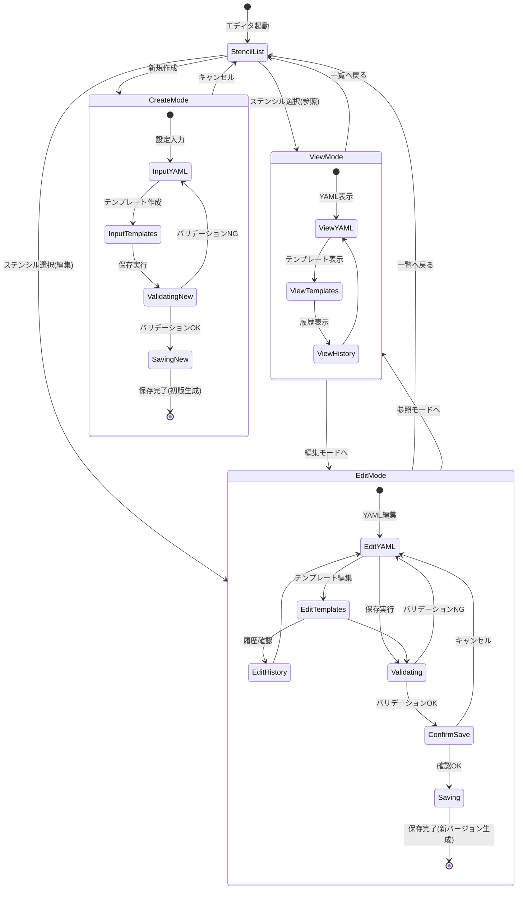

# 🎨 ProMarker ステンシルエディタ実装仕様

## 📋 技術スタック

- **エディタ**: CodeMirror 6
- **バリデーション**: Zod
- **差分表示**: react-diff-viewer
- **UI**: @mirel/ui (shadcn/ui)

---

## 📁 ステンシルファイル構造

### ディレクトリ構成

```
/user/{category}/{stencil-id}/{serial}/
├── stencil-settings.yml           # メイン設定(必須)
├── {prefix}_stencil-settings.yml  # カテゴリ共通設定(オプション)
└── files/
    ├── *.ftl                      # FreeMarkerテンプレート
    ├── .gitkeep                   # 空ディレクトリ保持
    └── {その他}                    # 固定ファイル
```

### ファイル種別

| 種別 | 編集 | 説明 |
|------|-----|------|
| `stencil-settings.yml` | ✅ | YAML設定、Zodバリデーション |
| `{prefix}_stencil-settings.yml` | ✅ | カテゴリ共通設定(専用エディタへリンク) |
| `*.ftl` | ✅ | FreeMarkerテンプレート |
| `.gitkeep` | ❌ | 読取専用 |
| その他 | ✅ | 拡張子から言語モード判定 |

### エディタUI構成

- **タブ**: メイン設定、カテゴリ共通設定、Templates、Static Files、Version History
- **ファイル分類**: classifyFile(), getLanguageMode(), isEditable()
- **バリデーション**: validateFtlFileName(), validateDirectoryName()

---

## 🔄 画面状態遷移図



### 状態遷移の詳細

#### 1. 初期状態 → モード選択
- **StencilList**: ステンシル一覧画面
  - 参照選択 → ViewMode
  - 編集選択 → EditMode
  - 新規作成 → CreateMode

#### 2. ViewMode (参照モード)
- **権限**: 読取専用
- **操作**: タブ切替(YAML/Templates/History)
- **遷移**: 編集モードへ切替可能

#### 3. EditMode (編集モード)
- **権限**: 編集可能
- **バリデーション**: リアルタイム + 保存時
- **保存フロー**:
  1. バリデーション実行
  2. 確認ダイアログ表示
  3. 新バージョン生成(YYMMDDx形式)
  4. DB更新

#### 4. CreateMode (新規作成モード)
- **権限**: 新規作成
- **必須項目**: stencil-settings.yml
- **保存**: 初版(xxxxxx**A**)として保存

---

## 🏗️ アーキテクチャ

### エディタモード

```typescript
export type EditorMode = 'view' | 'edit' | 'create';
```

### Zodスキーマ

```typescript
export const StencilConfigSchema = z.object({
  id: z.string().regex(/^\/[a-z0-9\-_\/]+$/),
  name: z.string().min(1).max(200),
  serial: z.string().regex(/^\d{6}[A-Z]$/),
  // ...
});
```

### バージョン管理

```typescript
export interface StencilVersion {
  serial: string;
  createdAt: string;
  createdBy: string;
  isActive: boolean;
}
```

---

## 💻 フロントエンド実装

### ディレクトリ構造

```
apps/frontend-v3/src/features/stencil-editor/
├── api/                 # API呼び出し
├── components/          # UIコンポーネント
├── hooks/               # カスタムフック
├── schemas/             # Zodスキーマ
├── types/               # 型定義
└── utils/               # ユーティリティ
```

### 主要コンポーネント

- **StencilEditor**: メインエディタ
- **YamlEditor**: CodeMirror + YAML + リアルタイムバリデーション
- **TemplateEditor**: FreeMarker編集
- **DiffViewer**: react-diff-viewer統合
- **VersionControl**: 履歴表示・復元

---

## 🔧 バックエンド実装

### 既存資産

#### StorageConfig
```java
public static String getUserStencilDir();      // user層
public static String getStandardStencilDir();  // standard層
public static String getSamplesStencilDir();   // samples層(classpath)
public static boolean isAutoDeploySamples();
```

#### MsteStencilRepository
```java
@Entity
@Table(name = "mste_stencil")
public class MsteStencil {
    @Id public String stencilCd;
    public String stencilName;
    public String itemKind;  // 0:カテゴリ, 1:ステンシル
}
```

#### 既存サービス

| サービス | 役割 | 状況 |
|---------|------|------|
| SuggestService | UIドロップダウン | ✅ |
| GenerateService | コード生成 | ✅ |
| ReloadStencilMasterService | DB再構築 | ✅ |
| UploadStencilService | アップロード | ⚠️ TODO |

### 新規API

#### StencilEditorController

```java
@RestController
@RequestMapping("/apps/mste/editor")
public class StencilEditorController {
    
    @GetMapping("/{stencilId}/{serial}")
    public ApiResponse<LoadStencilResponse> getStencil(...);
    
    @PostMapping("/save")
    public ApiResponse<SaveStencilResponse> saveStencil(...);
    
    @PostMapping("/common/{categoryId}")
    public ApiResponse<Void> saveCommonSettings(...);
    
    @GetMapping("/{stencilId}/versions")
    public ApiResponse<List<VersionInfo>> getVersionHistory(...);
}
```

#### StencilEditorService

```java
@Service
@Transactional
public class StencilEditorServiceImp implements StencilEditorService {
    
    @Autowired private MsteStencilRepository stencilRepository;
    
    /**
     * レイヤー検索: user → standard → samples
     */
    @Override
    public ApiResponse<LoadStencilResponse> loadStencil(String stencilId, String serial) {
        String[] layers = { 
            StorageConfig.getUserStencilDir(),
            StorageConfig.getStandardStencilDir()
        };
        // レイヤーごとに検索、最初に見つかったものを返す
    }
    
    /**
     * userレイヤーに新シリアル番号で保存
     */
    @Override
    public ApiResponse<SaveStencilResponse> saveStencil(SaveStencilRequest request) {
        String newSerial = generateNewSerial();  // yyMMddA
        String userDir = StorageConfig.getUserStencilDir();
        // Files.write()で保存
        // MsteStencilRepository.save()でDB更新
    }
}
```

---

## 🔒 セキュリティ

- **パストラバーサル防止**: StorageUtilが自動的にベースディレクトリ外アクセスをブロック
- **XSS対策**: CodeMirrorの自動エスケープ + 入力サニタイゼーション
- **バリデーション**: `SanitizeUtil.sanitizeCanonicalPath()`, `TemplateEngineProcessor.constructSecurePath()`

---

## 📊 実装フェーズ

### Phase 1: 基本エディタ(2週間)
- CodeMirror 6統合
- CRUD API実装
- Zodバリデーション

### Phase 2: バリデーション(1週間)
- リアルタイムバリデーション
- エラー表示UI

### Phase 3: バージョン管理(2週間)
- 履歴API
- 差分表示
- 復元機能

### Phase 4: UX改善(1週間)
- 自動保存
- ショートカット
- プレビュー

---

## 📦 依存関係

```json
{
  "dependencies": {
    "@uiw/react-codemirror": "^4.23.5",
    "@codemirror/lang-yaml": "^6.1.1",
    "@codemirror/lint": "^6.8.2",
    "react-diff-viewer-continued": "^3.4.0",
    "zod": "^3.24.1",
    "js-yaml": "^4.1.0"
  }
}
```

---

## ✅ 成功指標

1. **安全性**: パストラバーサル攻撃テスト100%通過
2. **パフォーマンス**: 100ファイル編集3秒以内
3. **UX**: ショートカット対応80%以上
4. **信頼性**: バージョン復元99.9%成功
5. **バンドルサイズ**: 増加2MB以内

---

## 📚 参考資料

- [CodeMirror 6](https://codemirror.net/)
- [react-diff-viewer](https://github.com/praneshr/react-diff-viewer)
- [Zod](https://zod.dev/)

---

**実装方針**: CodeMirror 6採用により軽量かつ拡張可能なエディタを実現。StorageConfig等の既存資産を最大限活用。
