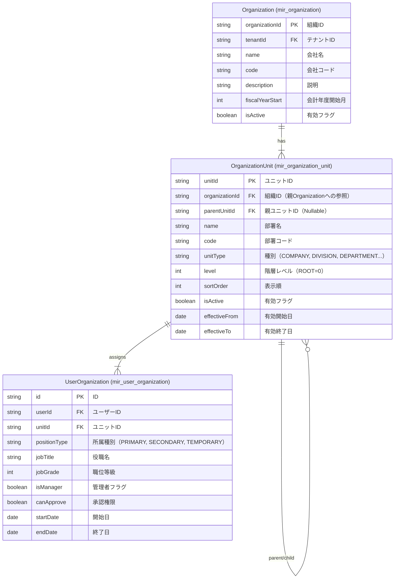
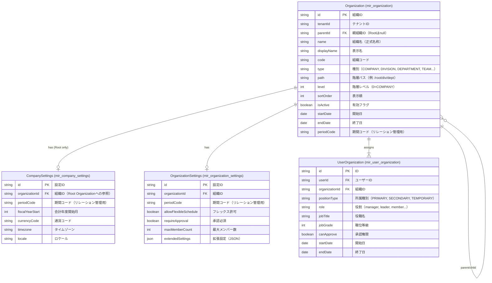

# 組織エンティティ ER図

## 1. 現状 (As-is)

### 現状の課題

| 課題                   | 詳細                                                                                            |
| :--------------------- | :---------------------------------------------------------------------------------------------- |
| **構造の二重化**       | `Organization` が「会社（Level 0）」として固定されているため、`OrganizationUnit` と役割が重複。 |
| **冗長なリレーション** | `UnitType.COMPANY` が存在するにも関わらず、別エンティティとして `Organization` が必須。         |
| **設定の分離不足**     | 会社設定（`fiscalYearStart` 等）が `Organization` に埋め込まれており、拡張性が低い。            |

---

## 2. あるべき姿 (To-be)

---

## 3. 変更点サマリ

| 項目                   | As-is                       | To-be                                    | 備考                                     |
| :--------------------- | :-------------------------- | :--------------------------------------- | :--------------------------------------- |
| **会社エンティティ**   | `Organization` (別テーブル) | `Organization` (Root Node, type=COMPANY) | 統合により1テーブルへ集約                |
| **会社設定**           | `Organization` に埋め込み   | `CompanySettings` テーブルへ分離         | Root Organizationのみが持つ              |
| **組織設定**           | なし                        | `OrganizationSettings` テーブルを新設    | 基本項目＋JSON拡張値                     |
| **表示名**             | なし                        | `displayName` カラム追加                 | 正式名称と表示名を分離                   |
| **期間管理**           | `effectiveFrom/To`          | `startDate`, `endDate`, `periodCode`     | リレーション管理用に `periodCode` を追加 |
| **マネージャーフラグ** | `isManager` (boolean)       | `role` (String)                          | より柔軟な役割定義へ変更                 |
| **パス階層**           | なし                        | `path` カラム追加                        | 検索効率化のため                         |

---

## 4. 補足: UnitType Enum

`Organization.type` には以下の値を想定します（現行の `UnitType` を踏襲）。

| Type         | 説明                     |
| :----------- | :----------------------- |
| `COMPANY`    | 会社（Root）             |
| `DIVISION`   | 本部                     |
| `DEPARTMENT` | 部                       |
| `SECTION`    | 課                       |
| `TEAM`       | チーム                   |
| `PROJECT`    | プロジェクト（期間限定） |
| `VIRTUAL`    | バーチャル組織           |

---

## 5. 次のステップ

To-be ER図の承認後、以下を実施予定:

1. アプリケーションの影響範囲調査
2. 詳細設計（DDL / Entity クラス定義）
3. 実装・テスト
